# **Actividad 03 - Chatbot en Messenger**

## 🎯 **Objetivo**
El objetivo de esta actividad es que desarrolles e integres un chatbot utilizando Dialogflow en la plataforma de Facebook Messenger, aplicando los conceptos fundamentales sobre la creación de interacciones conversacionales automatizadas. A través de esta tarea, aprenderás a definir y gestionar intents (intenciones), configurar respuestas enriquecidas y utilizar contextos para mantener un flujo natural en las conversaciones. Además, comprenderás el proceso de integración entre Dialogflow y Facebook Messenger, permitiendo que tu chatbot interactúe con usuarios en tiempo real. Al finalizar la actividad, deberás demostrar el correcto funcionamiento de tu chatbot, documentando su diseño, las dificultades encontradas y las decisiones que tomaste durante el proceso de desarrollo..

---

## 📑 Instrucciones
Con la ayuda del instructor realiza lo siguiente:  

1. Creación de una página de Facebook para tu proyecto final
    1. Entra a [Facebook](https://www.facebook.com/)
    2. Inicia sesión con tu cuenta
    3. En la parte izquierda, da clic en “Ver más”, como se ve a continuación
       

        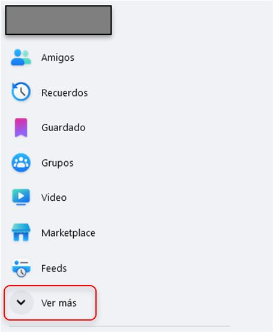
        

    4. A continuación, da clic en “Páginas” y posteriormente en “Crear nuevo perfil o página”
        

        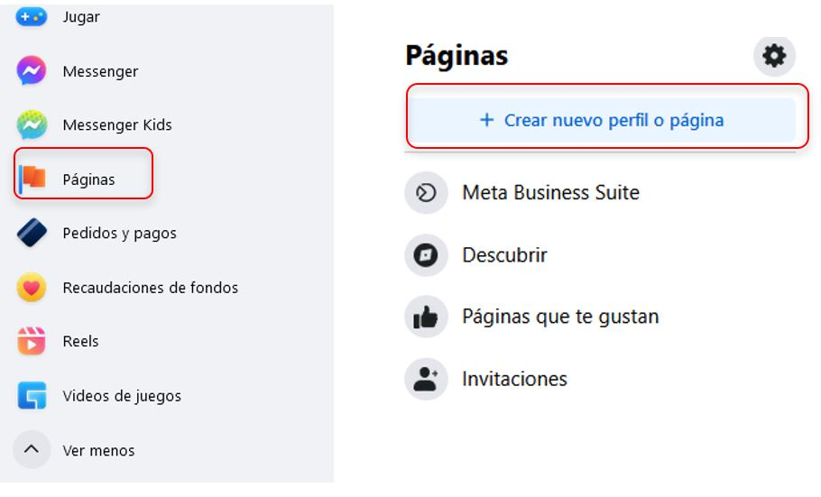
        

    6. Da clic en “Página pública” y da clic en “Siguiente”
        

        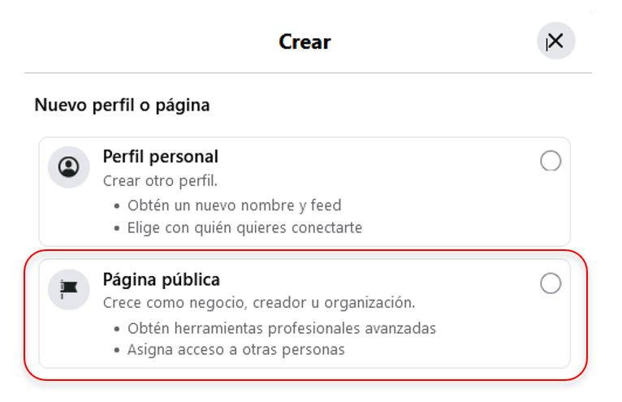
        

    8. Comienza a crear tu página de Facebook sobre tu proyecto final. Por el momento solo crea tu página, la podrás personalizar en otro momento
2. Conectando tu Chatbot de Dialogflow con Messenger de tu página de Facebook. En este caso utilizaré PizzaBot como ejemplo
    1. De lado izquierdo, da clic en “Integrations”
       

        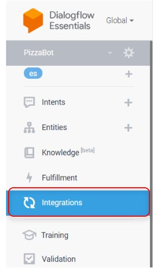
        

    2. Buscar “Messenger from Facebook” y dar clic
    3. Ir a https://developers.facebook.com/
    4. Iniciar sesión con la cuenta que se creo la página de Facebook
        

        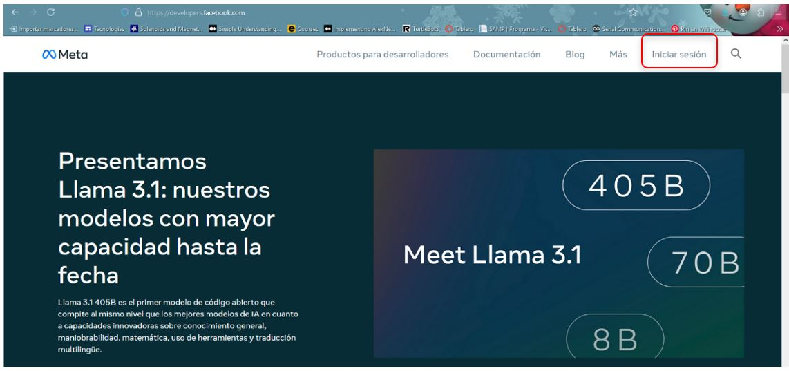
        

    5. Una vez que hayas iniciado sesión, da clic en Mis apps y clic en “Crear App”
       

        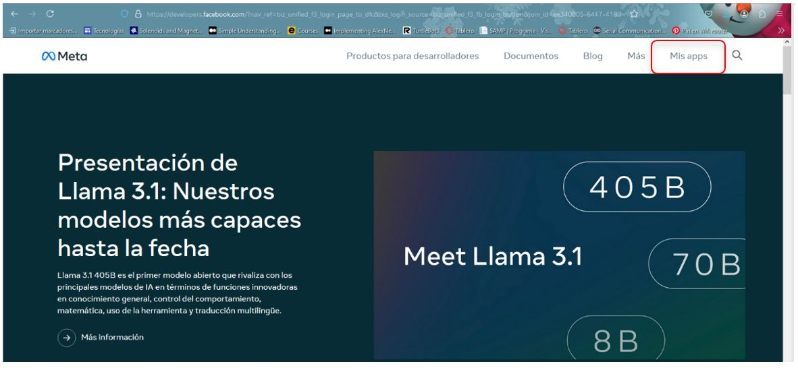
        

        

        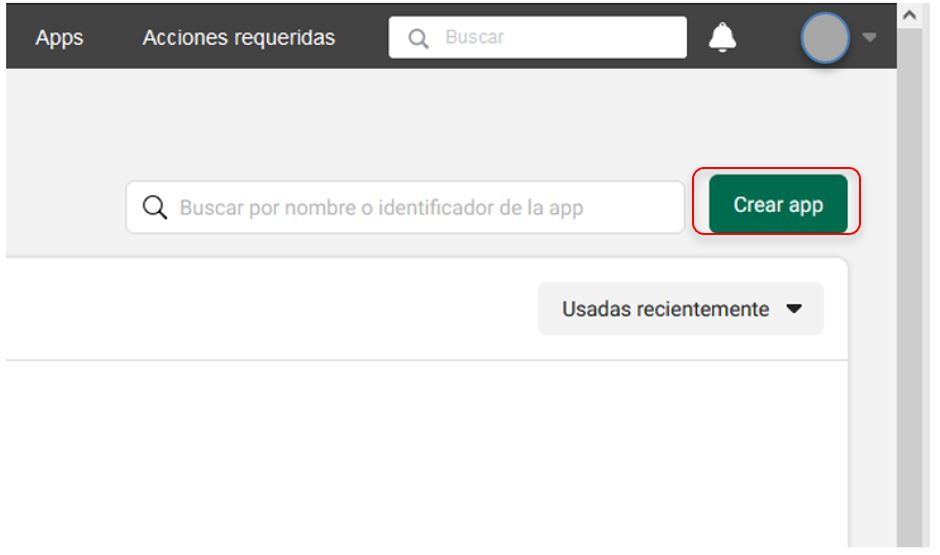
        

    7. Da clic en “Siguiente”, como se ve a continuación
       

        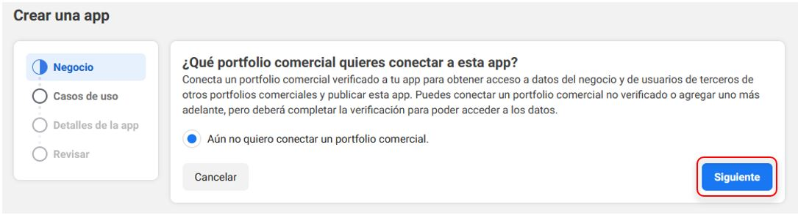
        

    9. Posteriormente selecciona “Otro” y en “Siguiente”
        

        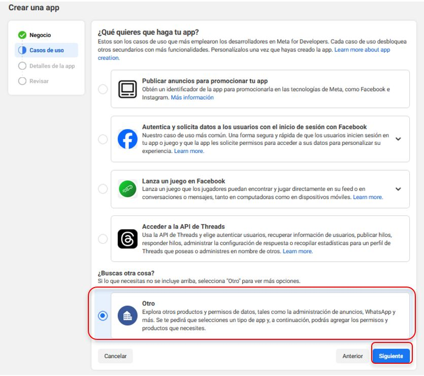
        

    11. Selecciona “Negocios” como el tipo de tu app
        

        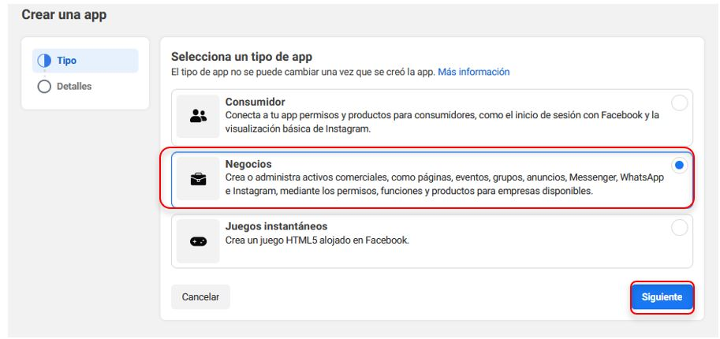
        

    13. Coloca un nombre a tu app y coloca tu correo electrónico y da clic en “Crear App”
        

        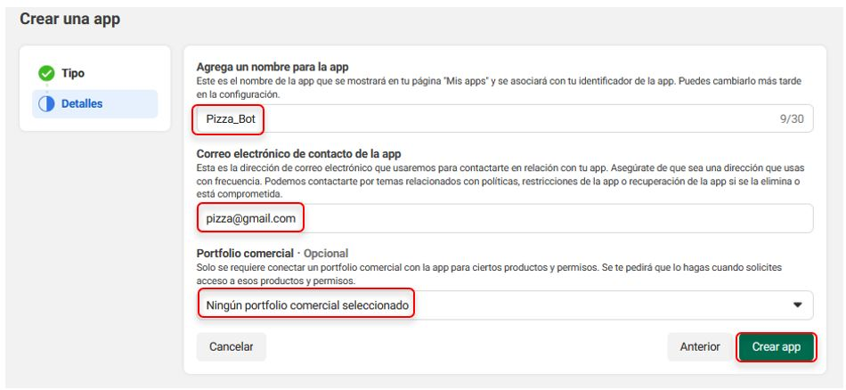
        

    15. Una vez que hayas creado tu App, de la página que apareció, en la parte de la derecha, busca “Messenger” y da clic en “Configurar”
        

        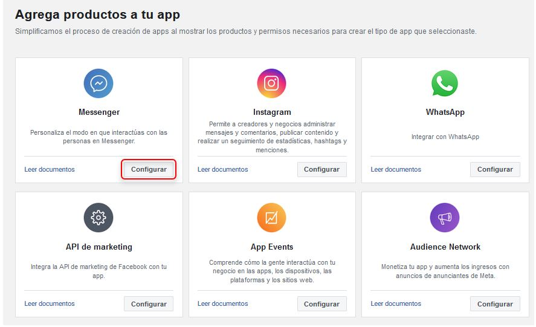
        

    17. Ve hacía la parte inferior de la página a la sección “2. Generar tokens de acceso” y da clic en “Conectar”
        

        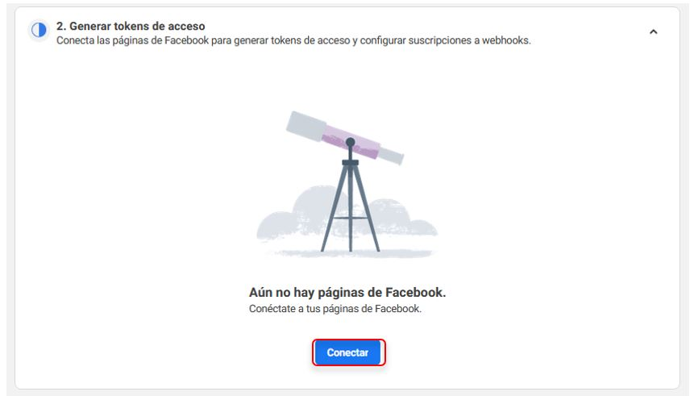
        

    19. Selecciona la página a la cual quieres agregar tu Chatbot. En mi caso, agregaré “Pizza_Bot” a la página “Pizza AI”. Posteriormente da clic en “Continuar”, “Guardar” y “De acuerdo”
        

        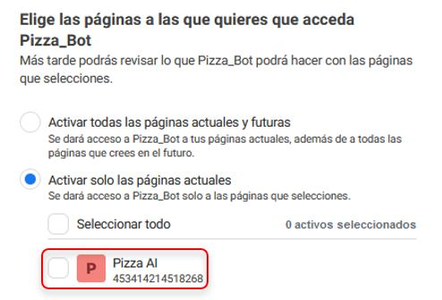
        

    21. Volvemos a ir a la sección “2. Generar tokens de acceso” pero esta vez daremos clic en “Generar”
        

        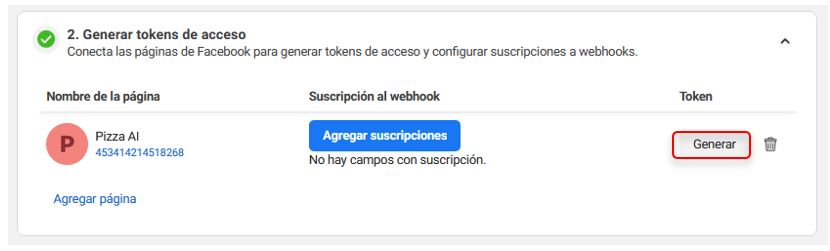
        

    23. Del cuadro de diálogo que te apareció, da clic en “Acepto” y copia el token. Es muy importante que no compartas con nadie este token de acceso.
        

        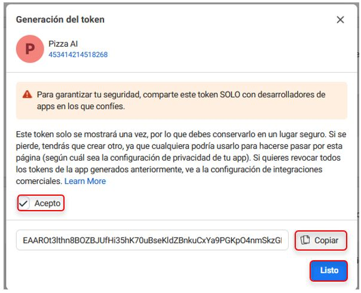
        

    25. Ahora dirígete a tu chatbot en Dialogflow y pega tu token de acceso en el campo “Page Access Token”. Además, en el campo “Verify Token” escribe la palabra “facebook” como palabra de verificación. Por último, da clic en “Start”
        

        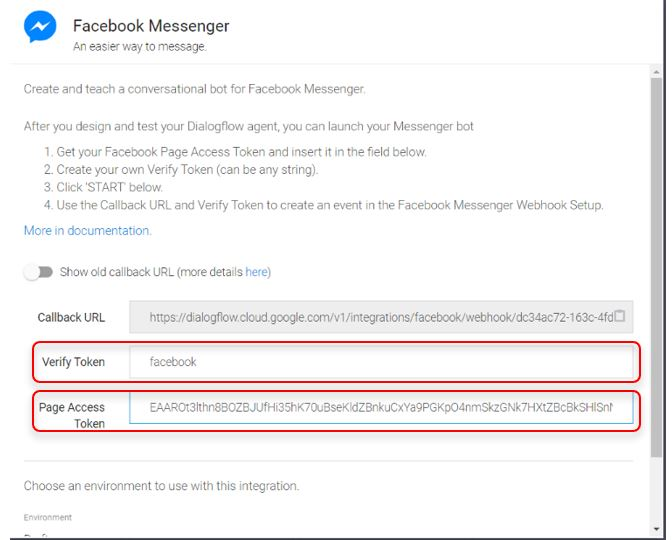
        

    27. Ahora dirígete a la página de desarrolladores de Facebook, en la sección “1. Configurar webhooks” y da clic en “Configure”
        

        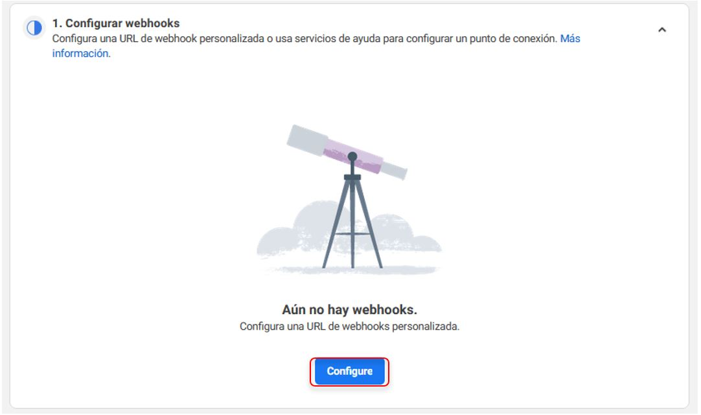
        

    29. En el campo “URL de devolución de llamada” pega la información que se encuentra en tu Chatbot en el campo “Callback URL”. En el campo “Token de verificación” escribe tu token de verificación que creaste, en nuestro caso fue “facebook”. Por último da clic en “Verificar y guardar”
        

        
        

    31. En la página de Facebook developers, en la sección “2. Generar tokens de acceso”, dar clic en “Agregar suscripciones” y agregar las siguientes:
        

        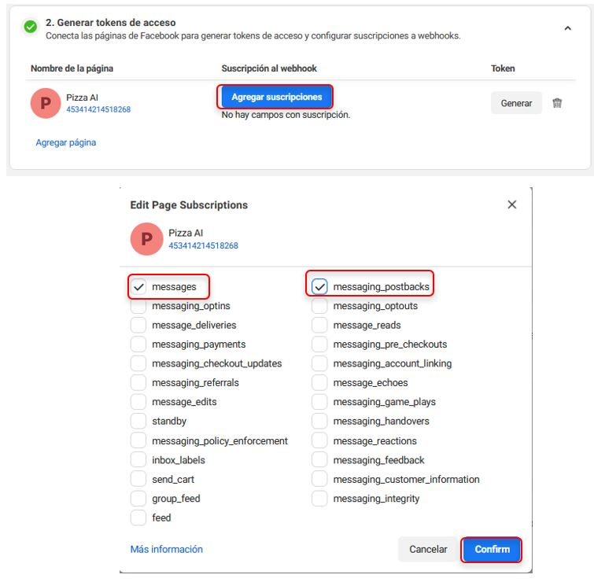
        

    33. Por último, clic en “Confirm”
  
3. Probando tu Chatbot en Messenger

---

## ❓ **Momento de introspección**

