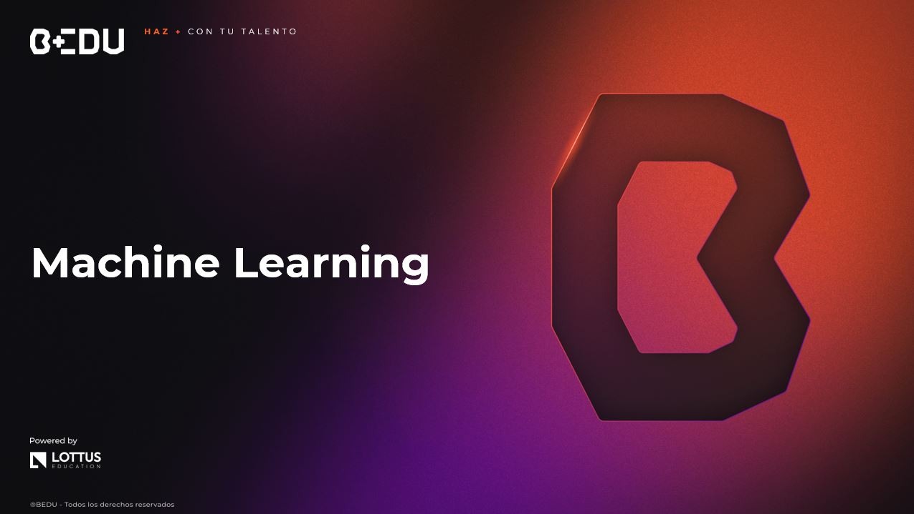

 🏠 [**Inicio**](../README.md) ➡️ / 📖 `Sesión 01`

    

## 🎯 Objetivos

⚒️ El objetivo de esta sesión es proporcionarte una comprensión integral de los chatbots y su funcionamiento. A lo largo de la sesión, explorarás los diferentes tipos de chatbots y su clasificación, aprenderás cómo el procesamiento del lenguaje natural (NLP) permite a estos agentes comprender y responder a las interacciones de los usuarios, y conocerás los modelos de lenguaje que respaldan su capacidad para generar respuestas coherentes y naturales. Además, te familiarizarás con Dialogflow, una herramienta avanzada para construir y gestionar chatbots, y aprenderás a implementar agentes conversacionales efectivos que mejoren la interacción y automatización en diversos contextos. Al final de la sesión, estarás preparado para diseñar, desarrollar e integrar chatbots que optimicen la comunicación y los procesos dentro de tu entorno de trabajo o proyectos personales.

---

 📘 Material del prework:
En el prework podrás encontrar la parte teórica que utilizaremos para realizar los ejercicios de esta sesión. 
🔥¡Vamos a comenzar!🔥

---

## 📂 Temas de la sesión...

### 📖 Introducción a los chatbots y sus tipos

Un chatbot es un programa de software diseñado para simular una conversación humana a través de interacciones de texto o voz. Utiliza reglas predefinidas o algoritmos avanzados de inteligencia artificial (IA) para procesar la entrada del usuario y generar respuestas. Los chatbots son utilizados ampliamente en aplicaciones como atención al cliente, comercio electrónico, marketing, y más recientemente en la educación y la salud. Al automatizar las interacciones, los chatbots mejoran la eficiencia operativa y proporcionan una experiencia de usuario más fluida.

---

### 📖 Procesamiento del lenguaje natural (NLP) en chatbot

El Procesamiento del Lenguaje Natural (NLP) es una tecnología fundamental para mejorar la capacidad de los chatbots de comprender y generar lenguaje humano de manera efectiva. Cuando te adentras en el mundo de los chatbots, es esencial entender cómo el NLP permite que estos sistemas interpreten el texto o el habla de los usuarios y respondan de manera coherente. El NLP permite que los chatbots no solo reconozcan las palabras que los usuarios utilizan, sino que también comprendan el contexto y el significado detrás de esas palabras. Esto se logra a través de una serie de procesos, como la tokenización, que descompone el texto en unidades más pequeñas, y el análisis de sintaxis, que examina la estructura gramatical de las frases. Estos pasos son cruciales para que el chatbot pueda identificar la intención del usuario y proporcionar una respuesta adecuada.

---

### 📖 Modelos de lenguaje para chatbots

Los Modelos de Lenguaje en el Procesamiento del Lenguaje Natural (NLP) para Chatbots son el núcleo que permite a estos sistemas interpretar, generar y responder a las entradas de texto o voz de los usuarios de manera coherente y relevante. Estos modelos están diseñados para analizar y comprender el lenguaje humano, lo que permite que los chatbots generen respuestas que imiten conversaciones humanas naturales. Los modelos de lenguaje son algoritmos de inteligencia artificial entrenados para predecir o generar texto. El objetivo principal de estos modelos es comprender y producir lenguaje humano de manera que se pueda usar para una variedad de tareas, como la traducción de idiomas, la generación de texto, el resumen automático y, en el caso de los chatbots, la creación de respuestas conversacionales.

---

### 📖 Dialogflow

Dialogflow es una plataforma desarrollada por Google que permite diseñar y construir interfaces conversacionales, como chatbots y asistentes virtuales, utilizando el procesamiento del lenguaje natural (NLP).  Dialogflow es una plataforma altamente versátil que permite a los desarrolladores crear agentes conversacionales sofisticados, como chatbots y asistentes virtuales, que pueden interactuar con los usuarios mediante texto o voz. Su capacidad de procesar el lenguaje natural y aprender de los datos de conversación lo convierte en una herramienta ideal para automatizar interacciones, mejorar la experiencia del usuario y optimizar procesos en una amplia variedad de industrias.

---

### ✏️ Actividades

#### 📕 **[Actividad 01: Pizzabot](/Sesión-07/Actividad-01/README.md)**
#### 📕 **[Actividad 02: Chatbot para tu Proyecto Final](/Sesión-07/Actividad-02/README.md)**

---

⬅️ [**Anterior**](../Sesión-05/README.md) | [**Siguiente**](../Sesión-07/README.md)➡️
